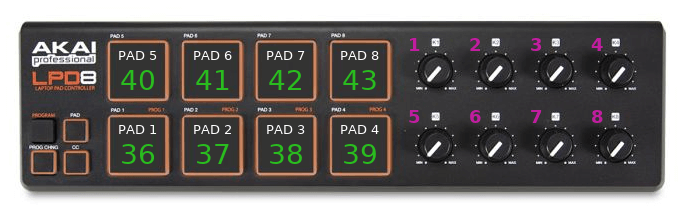

# Using the Akai LPD8 from CLI

I've recently acquired an [Akai LPD8](https://amzn.to/2Qc040Q), which is a MIDI device that connects through USB and acts as a MIDI device out of the box. It consists of 8 pads and 8 knobs.
The pads are backlit, and by default they turn on briefly whenever they are pressed.

## Tooling

The two tools mentioned here (`aseqdump` and `amidi`) belong to the `alsa-utils` package.

## Receiving MIDI events

Using `aseqdump` it's easy to get all the events of the device as they happen. First, find out how the system sees the device:

```console
$ aseqdump -l
 Port    Client name                      Port name
  0:0    System                           Timer
  0:1    System                           Announce
 14:0    Midi Through                     Midi Through Port-0
 24:0    LPD8                             LPD8 MIDI 1
```

In this case, it's named `LPD8` and it's connected on port `24:0`.
To monitor events, the same application is run with the `-p` parameter specifying either the client name or its port.
Specifying the port instead of the client name is more specific, but not as easy to maintain if the port changes over time.
Both these commands are valid for the current example:

* `aseqdump -p "LPD8"`
* `aseqdump -p "24:0"`

From this point onwards it's trivial to use the incoming events as needed.
The following script shows how it's possible to loop over them (inspired by a simple but powerful [script](https://superuser.com/a/1170232) found on StackOverflow):

```bash
#!/bin/bash

aseqdump -p "LPD8" | \
while IFS=" ," read src ev1 ev2 ch label1 data1 label2 data2 rest; do
  [[ "$ev2" == "on" ]] || continue
  notify-send "MIDI event" "Pad $((data1 - 35)) pressed" -t 1000
done
```

## Controlling the LPD8 leds

The pad backlights can be turned on by sending notes to the device. As before, the address of the device is required to operate (the one listed by `aseqdump` can't be used, as `amidi` uses a different format).

```console
$ amidi -l
Dir Device    Name
IO  hw:2,0,0  LPD8 MIDI 1
```

For this example, the address is `hw:2,0,0`. In order to turn on one of the pads, the following hex message is sent:

```sh
amidi -p "hw:2,0,0" -S "90 24 7F"
```

Where:

* `90` is the _note on_ MIDI instruction
* `24` specifies the MIDI _note_ (which corresponds to a pad in this case)
* `7F` is the MIDI _velocity_ (127 in decimal), for LPD8 it must be below 128

A similar command is used to turn off one light, but changing the instruction from _note on_ to _note off_ (`80`):

```sh
amidi -p "hw:2,0,0" -S "80 24 7F"
```

The default notes corresponding to the pads 1-8 are hex values `24` through `2B` (decimal: 36 to 43).


